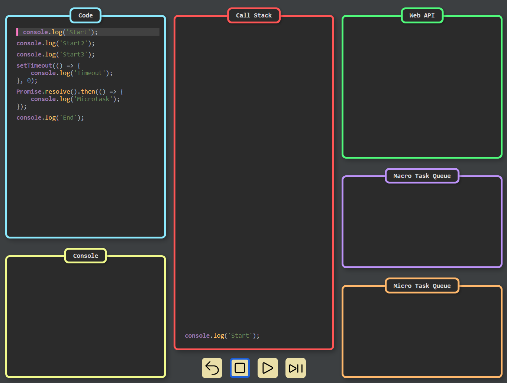

# Event Loop Visualizer

## Описание проекта

**Event Loop Visualizer** – это веб-приложение, предназначенное для визуализации работы Event Loop в JavaScript. Оно позволяет наглядно демонстрировать, как выполняются задачи в стеке вызовов (Call Stack), Web API, очередях задач (Macro Task Queue и Micro Task Queue).

## Структура проекта

```
Event Loop Visualizer/
│── index.html        # Основная HTML-страница
├── code.js           # Исходные данные (кодовые строки и шаги анимации)
│── assets/
│   ├── styles.css    # Файл со стилями
│   ├── script.js     # Главный скрипт для управления анимацией
│── README.md         # Документация проекта
```

## Основные компоненты

1. **Code (Исходный код)** – отображает исполняемый JavaScript-код.
2. **Call Stack (Стек вызовов)** – показывает, какие функции находятся в стеке исполнения.
3. **Web API** – отображает механизмы Web API (например, `setTimeout`).
4. **Macro Task Queue (Очередь макрозадач)** – показывает макрозадачи, ожидающие выполнения.
5. **Micro Task Queue (Очередь микрозадач)** – отображает микрозадачи (например, промисы).
6. **Console (Консоль вывода)** – демонстрирует результат выполнения кода.
7. **Кнопки управления** – позволяют управлять анимацией:
    - **Start** – запустить анимацию выполнения кода.
    - **Next** – выполнить следующий шаг.
    - **Stop** – остановить анимацию.
    - **Reset** – сбросить анимацию.

## Функциональность

- Анимация выполнения JavaScript-кода.
- Перемещение кода между разными компонентами Event Loop.
- Подсветка активных строк кода.
- Очередное выполнение шагов с возможностью паузы и сброса.

## Используемые технологии

- **HTML, CSS, JavaScript** – базовая структура и логика работы приложения.
- **GSAP** – библиотека для анимации перемещения кода между компонентами.

## Как задать сценарий выполнения кода?

### 1. Добавление строк кода (`codeLines`)

Этот массив содержит исполняемый код и его разметку:
```js
export const codeLines = [
    { codeId: 1, text: "console.log('Start');" },
    { codeId: 2, text: "setTimeout(() => console.log('Timeout'), 0);" },
    { codeId: 3, text: "Promise.resolve().then(() => console.log('Microtask'));" }
];
```

Каждый объект в массиве должен содержать:
- `codeId` – уникальный идентификатор строки кода.
- `text` – HTML-разметку строки с подсветкой синтаксиса.

### 2. Добавление шагов анимации (`steps`)

Этот массив управляет тем, как код перемещается между областями визуализации:
```js
export const steps = [
    { elementId: 1, codeId: 1, to: 'stack' },
    { elementId: 1, codeId: 1, to: 'console', newCode: "Start" },
    { elementId: 2, codeId: 2, to: 'stack' },
    { elementId: 2, codeId: 2, to: 'webapi' },
    { elementId: 3, codeId: 3, to: 'stack' },
    { elementId: 3, codeId: 3, to: 'microqueue' },
    { elementId: 3, codeId: 3, to: 'stack' },
    { elementId: 3, codeId: 3, to: 'console', newCode: "Microtask" },
];
```

### 3. Уничтожение кода (`destroy`)

Если код должен исчезнуть, используется параметр `destroy`:
```js
{ elementId: 4, codeId: 4, destroy: true }
```

Это удалит код после его выполнения.